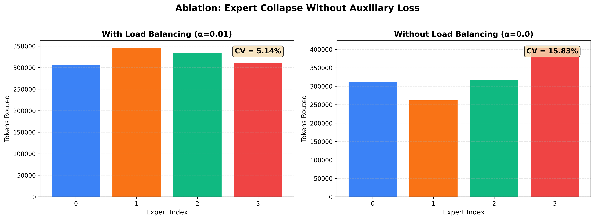
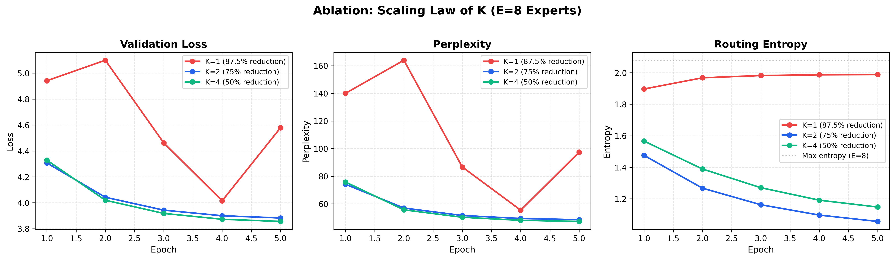
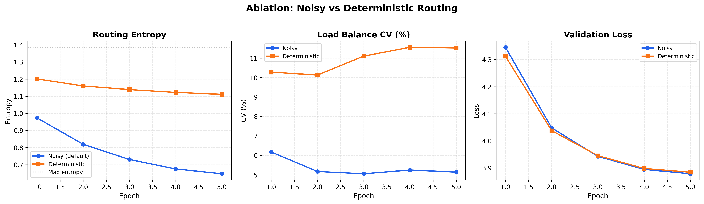

<div align="center">

# 🧠 Sparse Mixture-of-Experts (MoE) — PyTorch

**A from-scratch implementation of a Sparse MoE layer with full MLOps and HuggingFace integration.**  
Built to demonstrate deep understanding of routing stability, load balancing, capacity management, and LLM engineering.

[](https://www.python.org/)
[](https://pytorch.org/)
[](https://wandb.ai/)
[](https://huggingface.co/)
[](https://hydra.cc/)
[](https://www.docker.com/)
[](LICENSE)

</div>

---

## Overview

This project implements a **Sparse Mixture-of-Experts (MoE)** layer from scratch in PyTorch — the core architecture powering state-of-the-art models like [Switch Transformer](https://arxiv.org/abs/2101.03961), [Mixtral 8x7B](https://arxiv.org/abs/2401.04088), and Grok.

The goal is **pedagogical rigor mixed with practical ML engineering**: every design decision is tied to a mathematical principle, visually validated through ablations, and supported by standard MLOps practices (Weights & Biases tracking, Hydra config management, HuggingFace integration, Docker containerization, and autoregressive generation).

### Key Features
- ✅ **Top-$k$ Noisy Routing** — Shazeer et al.'s gating mechanism with learned Gaussian noise for exploration.
- ✅ **Auxiliary Load-Balancing Loss** — Prevents expert collapse via differentiable routing penalty.
- ✅ **Hard Capacity Constraints** — Token dropping at expert capacity limits (simulates hardware buffers).
- ✅ **Autoregressive Generation** — Standalone inference pipeline with KV-compatible design.
- ✅ **Production MLOps** — Weights & Biases experiment tracking, model checkpointing, Cosine LR scheduling.
- ✅ **Hydra Configuration** — Structured YAML configs with CLI overrides (no hardcoded hyperparameters).
- ✅ **HuggingFace Compatible** — `PreTrainedModel` wrapper with `from_pretrained()` / `save_pretrained()` / Hub push.
- ✅ **Docker Ready** — GPU-accelerated container with automatic CPU fallback.
- ✅ **Visual Proof of Correctness** — 4 distinct ablation suites to visually prove scaling laws and routing stability.

---

## 📐 The Mathematics of Routing

### 1. Top-$k$ Gating

Given a token embedding $x \in \mathbb{R}^{d}$ and a trainable gate matrix $W_g \in \mathbb{R}^{d \times E}$:

$$h(x) = x \cdot W_g$$

To encourage exploration during training, **learned Gaussian noise** is injected:

$$G(x) = \text{TopK}\!\left(\text{Softmax}\!\left(h(x) + \epsilon\right),\ k\right), \quad \epsilon \sim \mathcal{N}(0,\, \sigma^2)$$

### 2. Preventing Expert Collapse — $\mathcal{L}_\text{aux}$

Without intervention, the router collapses: one expert dominates and the others starve. The **Switch Transformer auxiliary loss** penalizes this:

$$\mathcal{L}_\text{aux} = \alpha \cdot E \sum_{i=1}^{E} f_i \cdot P_i$$

where:
- $f_i$ = fraction of tokens **actually routed** to expert $i$ (dispatch fraction)
- $P_i$ = mean routing **probability** assigned to expert $i$ across the batch

### 3. Entropy Regularization — $\mathcal{H}$

We additionally regularize the router's batch-level entropy to encourage sharp, confident routing decisions:

$$\mathcal{H} = -\frac{1}{T}\sum_{t=1}^{T} \sum_{i=1}^{E} p_{t,i} \log(p_{t,i} + \varepsilon)$$

---

## 📊 Ablations & Visual Proofs

The project includes an automated suite to visualize the impact of hyperparameter choices. Run `python visualize_ablations.py` after training.

### 1. Expert Collapse (The Importance of $\mathcal{L}_\text{aux}$)
Without the auxiliary loss penalty ($\alpha=0$), routing collapses and load balancing fails (CV spikes from 5% to 15%+).


### 2. K-Scaling Law (Top-1 vs Top-2 vs Top-4)
Demonstrates the tradeoff between computation (FLOPs) and perplexity. Increasing $K$ lowers perplexity at the cost of active parameters.


### 3. Noisy vs Deterministic Routing
Injecting noise into the router logits stabilizes load balancing across epochs, keeping CV% lower.


---

## 🚀 Quickstart

### 1. Clone & Setup

```bash
git clone https://github.com/Mohan14123/sparse-moe-pytorch.git
cd sparse-moe-pytorch

python3 -m venv .venv
source .venv/bin/activate
pip install -r requirements.txt
```

*(Note: Download the TinyStories dataset to `dataset/TinyStories/train.csv` before running).*

### 2. Run Unit Tests

Validates tensor shapes, capacity math, and gradient flow.

```bash
pytest test_moe.py -v
```

### 3. Train the Model

Train with Hydra config, W&B tracking, Mixed Precision, and Checkpointing:

```bash
# Default training (uses configs/default.yaml)
python train.py

# Override any parameter from the CLI
python train.py model.type=moe training.epochs=10 training.batch_size=64 logging.wandb=true

# Train the dense baseline
python train.py model.type=dense

# Quick experiment with subset of data
python train.py training.num_samples=5000 training.epochs=1
```

### 4. Autoregressive Text Generation

Load the trained checkpoint and generate text interactively:

```bash
python generate.py

# Override from CLI
python generate.py checkpoint=outputs/moe_best.pt \
                   prompt="Once upon a time" \
                   max_tokens=50 \
                   temperature=0.8
```

Example Output:
> *Prompt: "Once upon a time"*  
> *Once upon a time to the prett its name?" But the field. He said. "I can be a voice. They look at the boy smiled and it*

### 5. Export to HuggingFace

Convert a trained checkpoint to HuggingFace format:

```bash
# Save locally
python export_hf.py --checkpoint outputs/moe_best.pt --output_dir outputs/hf_model

# Push to HuggingFace Hub
python export_hf.py --checkpoint outputs/moe_best.pt --push_to_hub --hub_repo Mohan14123/sparse-moe
```

Then load it anywhere:

```python
from moe.hf_wrapper import SparseMoEForCausalLM
model = SparseMoEForCausalLM.from_pretrained("./outputs/hf_model")
# or from the Hub:
# model = SparseMoEForCausalLM.from_pretrained("Mohan14123/sparse-moe")
```

### 6. Docker

```bash
# Build the image
docker build -t sparse-moe .

# Train with GPU
docker run --gpus all -v $(pwd)/dataset:/app/dataset -v $(pwd)/outputs:/app/outputs sparse-moe

# Train with CPU fallback
docker run -v $(pwd)/dataset:/app/dataset -v $(pwd)/outputs:/app/outputs sparse-moe

# Generate text
docker run --gpus all -v $(pwd)/outputs:/app/outputs sparse-moe \
  python generate.py checkpoint=outputs/moe_best.pt prompt="Once upon a time"
```

### 7. Run Ablations & Visualize

```bash
# Run quick ablation on a subset of data (no noise)
python train.py model.noisy_routing=false training.num_samples=5000 output.dir=outputs/ablation_no_noise

# Generate publication-quality comparison charts
python visualize_ablations.py
```

---

## ⚙️ Configuration System

All hyperparameters are managed via [Hydra](https://hydra.cc/) YAML configs. No hardcoded values.

```yaml
# configs/default.yaml
model:
  type: moe
  d_model: 256
  d_ff: 512
  num_experts: 4
  top_k: 2
  capacity_factor: 1.5
  noisy_routing: true

training:
  epochs: 10
  batch_size: 64
  lr: 1e-3
  alpha: 0.01     # Auxiliary loss scale
  beta: 0.001     # Entropy penalty scale

logging:
  wandb: false
```

Override any value from the CLI: `python train.py model.num_experts=8 model.top_k=4 training.lr=5e-4`

---

## 🔬 Key Implementation Details

| Component | File | Highlight |
|---|---|---|
| **Router** | `moe/router.py` | Noisy top-k + soft/hard capacity control |
| **Expert** | `moe/experts.py` | Independent FFN blocks with GELU activation |
| **Dispatcher** | `moe/dispatcher.py` | Explicit gather-compute-scatter (no `einsum` magic) |
| **Aux Loss** | `moe/losses.py` | Switch Transformer $\mathcal{L}_\text{aux}$ + entropy penalty |
| **Generation** | `generate.py` | Autoregressive sampling with temperature scaling |
| **HF Wrapper** | `moe/hf_wrapper.py` | `PreTrainedModel` + `PretrainedConfig` for HF ecosystem |
| **Export** | `export_hf.py` | Checkpoint → HuggingFace format + Hub push |
| **Config** | `configs/default.yaml` | Hydra-managed YAML (no hardcoded hyperparameters) |
| **Docker** | `Dockerfile` | GPU-ready container with CPU fallback |

---

## License
MIT
